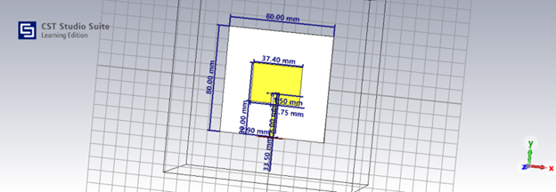
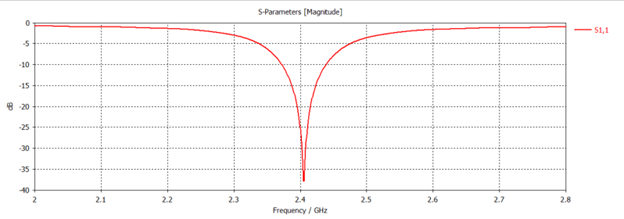
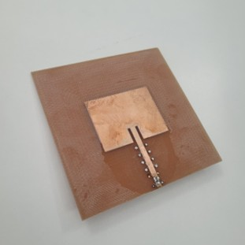
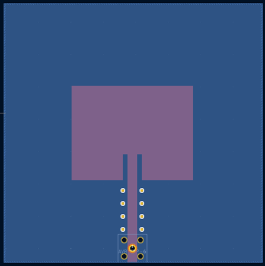
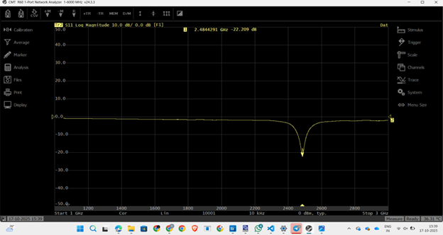

# RF Energy Harvester – 2.4 GHz

This repository contains the complete design, fabrication, and testing files for a **2.4 GHz RF Energy Harvester**, including antenna design, rectifier circuit design, CST simulations, KiCAD PCB layouts, fabrication outputs, and VNA measurement results.

The harvester is designed for low-power IoT applications and captures RF energy in the 2.4 GHz ISM band.  
The project includes **antenna simulation + PCB**, **rectifier circuit + PCB**, and full hardware testing.

---

## 1. Antenna Design (CST Studio)

The antenna was designed and optimized in **CST Studio** for the 2.45 GHz ISM band.

### Key Features  
- Designed for 2.4–2.5 GHz bandwidth  
- Simulated S11 < –22 dB at resonance  
- Fabricated as a **double-layer PCB**  
- Measured using **R60 Vector Network Analyzer**

### Antenna Images  
#### CST Antenna Model  


#### CST S11 Simulation  


#### Fabricated Antenna  


#### PCB Layout  


#### VNA Measurement (Hardware S11)  
Achieved a **return loss of –22.209 dB at 2.48 GHz**, which is excellent and closely matches simulations.



---

## 2. Antenna PCB Files (KiCAD)

The antenna PCB was fully designed in **KiCAD**, fabricated in the lab, and assembled manually.

### PCB Highlights  
- **Double-layer PCB** for RF stability  
- **Vias added** for grounding and performance  
- **Custom SMA connector footprint** created because KiCAD did not have the required part  
- SMA footprint file:
```
Antenna/Antenna_PCB_files/Library/SMAmale.kicad_mod
```

### PCB Files  
```
Antenna/Antenna_PCB_files/KiCAD pcb files
Antenna/Antenna_PCB_files/antenna_gerber_files.zip
Antenna/Antenna_PCB_files/Library/SMAmale.kicad_mod
```

---

## 3. Rectifier Circuit (ADS + KiCAD)

The rectifier circuit uses a multi-stage RF-to-DC rectification approach.  
The circuit was simulated in **ADS**, then designed as a **double-layer PCB** in KiCAD.

### Circuit Images  
#### Schematic  


#### PCB Layout  


#### Fabricated Rectifier Board  


### PCB Files  
```
Circuit_board_PCB_files/KiCAD pcb files
Circuit_board_PCB_files/gerber files (2).zip
Circuit_board_PCB_files/Library/SMA.kicad_mod
```

### PCB Highlights  
- Designed in **KiCAD**  
- **RF-friendly routing** with short traces  
- **Ground vias stitched** for stability  
- **Custom SMA connector footprint** added:
```
Circuit_board_PCB_files/Library/SMA.kicad_mod
```

---

## 4. Repository Structure

```
RF_Energy_Harvester_2.4GHz/
│
├── README.md
│
├── Antenna/
│   ├── Antenna_Images/
│   │   ├── Multiple_images
│   ├── Antenna_PCB_files/
│   │   ├── KiCAD_PCB_files
|   |   ├── gerber_files.zip
│   │   └── Library/SMAmale.kicad_mod
│   └── CST_Files/antenna3.cst
│
├── Cicuit_board_images/
│   ├── Circuit_PCB_layout.png
│   ├── Circuit_schematic.png
│   └── Fabricated_circuit.jpg
│
├── Circuit_board_PCB_files/
│   │   ├── KiCAD_PCB_files
│   ├── gerber files (2).zip
│   └── Library/SMA.kicad_mod
│
└── RF_Energy_Harvester_Documentation.pdf
```

---

## 5. Documentation

Complete design report, analysis, S11 results, and rectifier circuit details:

```
RF_Energy_Harvester_Documentation.pdf
```

---

## Summary

This repository contains:

- CST antenna simulation  
- KiCAD PCB design for antenna and rectifier  
- ADS circuit simulation  
- Fabricated double-layer PCBs  
- VNA-measured return loss of **–22.209 dB at 2.48 GHz**  
- Custom SMA footprints  
- Complete fabrication-ready Gerber files  

The project successfully demonstrates a working **2.4 GHz RF Energy Harvester** with close agreement between simulation and hardware of antenna only.
